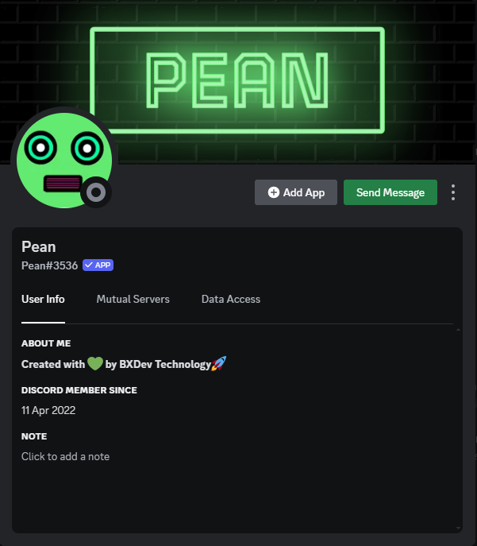

# 🎵 BXDev Technology Music Bot - Pea3 | Pean

<h4 align="center">Introducing BXDev's Pean (V3.0), where we bring the beats to your server! 🎶</h4>

## Featured Project: Pean - Discord Bot

 

### What is Pean?

Pean is our flagship project, bringing Music and Beats to your Discord Server. Check out the code, contribute, and let's make Pean even more awesome together!

- **Repository**: [Pean Discord Bot](https://github.com/BXDevTech/Pean)

## Achievement Unlocked: 🎵 Pean - Discord Bot

**Exciting News!** 🚀 BXDev Technology's Pean Discord Bot has hit a high note in its journey!

- 🌐 Surpassed 5K+ views and achieved an impressive 9+ downloads!
- 🎶 Continuously evolving with new features and enhancements.
- 🚀 Loved by a growing community of Discord enthusiasts.

Thank you for being part of the musical journey with Pean! Let's keep the beats alive! 🎉

## Prefix  >> * <<

## [Deploy Pean using Autocode](https://autocode.com/BuuyaXD/templates/discordbot-pea3/)
Explore and deploy Pean effortlessly on Autocode. Click the link above to get started.

## Deployment using Autocode

1. **Sign Up on Autocode:**
   - If you don't have an Autocode account, start by signing up on [Autocode](https://autocode.com/).
   - It's a quick and easy process. Follow the on-screen instructions to create your account.

2. **Visit the Deployment Link:**
   - Once logged in, navigate to [this deployment link](https://autocode.com/BuuyaXD/templates/discordbot-pea3/).
   - This link will take you to the Autocode project template for Pean.

3. **Configure Your Discord Bot:**
   - Follow the prompts to set up your Discord bot on Autocode.
   - Provide the necessary information, including your Discord bot token and any required configurations.

4. **Deploy Your Bot:**
   - Click on the "Deploy" button to initiate the deployment process.
   - Autocode will handle the deployment and hosting of your Discord bot, so you don't have to worry about server management.

5. **Access and Manage Your Bot:**
   - Once deployed, you can access and manage your bot directly from your Autocode dashboard.
   - Make any necessary updates or changes to your bot's code using the built-in code editor.

6. **Enjoy Seamless Hosting:**
   - Autocode takes care of the hosting and maintenance of your Discord bot, allowing you to focus on enhancing its features and functionality.

Now, you're all set! Your Pean Discord bot is deployed, hosted, and ready to bring music to your server.

**Note:** If you encounter any issues or have questions during the deployment process, feel free to reach out to Autocode support or refer to their documentation for assistance.

For more detailed instructions or troubleshooting, refer to the [Autocode Documentation](https://docs.autocode.com/). If you have any specific questions about Pean, join our [Support Server](https://discord.gg/SsW9HPKnUR) for assistance.

## Visual Preview

### Screenshot 1

### Screenshot 2

### Screenshot 3

### Screenshot 4

## Commands

- *help*: Get information on the available commands.
- *setup*: Set up the bot in a specific channel **(REQUIRED)**.
- *play*: Play your favorite songs in your channel.
- *search*: Search on Youtube, Google + more right within Discord.
- *fun* : Have fun and explore!
- *utility* : Just the boring stuff!

## Links

- [GitHub Page](https://github.com/bxdevtech): Check out our open-source project.
- [Support Server](https://discord.gg/SsW9HPKnUR): Join our Discord community for assistance.

## Update Log - Version 3.0.0

- Added **Utility**
- Fixed **search**
- Improved **Setup**
- Updated all commands
- Minor embed changes
- Major bug fix
- Major audio fix

## Features

- 🎶 High-quality audio streaming
- 🔍 In-depth searching capabilities
- 🛠️ Extensive utility commands
- 🎲 Fun and interactive commands
- 🔄 Regular updates and improvements

## Getting Started

Ready to dive in? Follow these simple steps to get started:

1. **Clone the repository**: `git clone https://github.com/BXDevTech/Pean`
2. **Install Dependencies**: [Instructions on how to install dependencies]
3. **Build and Run**: [Instructions on how to build and run the project]

Need help or have questions? Reach out to us at [bxdevtech@gmail.com] - we're here for you!

## 🚀 Contribution Guidelines

We ❤️ contributions from the community! Whether you're a coding wizard or just starting, your input is valuable. Here's how you can get involved:

- **Fork the repository**
- **Create a new branch**: `git checkout -b feature/your-feature`
- **Make your changes and commit**: `git commit -m 'Add your feature'`
- **Push to the branch**: `git push origin feature/your-feature`
- **Open a pull request**

Let's build something amazing together!

## Code of Conduct: BXDev Technology Code of Conduct

Before you dive in, please review and adhere to our [Code of Conduct](CODE_OF_CONDUCT.md). We're all about creating a positive and inclusive community.

## License: BXDev Technology Proprietary License

Please review our [License](LICENSE) to understand how you can use and contribute to our projects.

🌟 Thank you for choosing BXDev Technology! Let's innovate, create, and build the future together. 🌟

